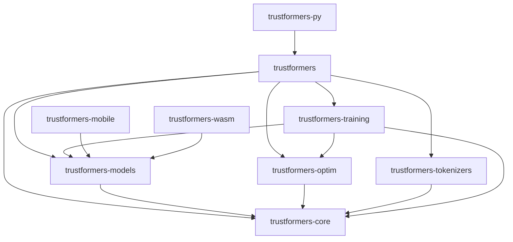

# TrustformeRS Architecture Guide

This guide provides a comprehensive overview of TrustformeRS's architecture, design principles, and implementation details.

## Overview

TrustformeRS is designed as a modular, high-performance transformer library for Rust with a focus on:
- **Performance**: Leveraging Rust's zero-cost abstractions and SciRS2 for numerical operations
- **Safety**: Memory safety and thread safety guaranteed by Rust's type system
- **Modularity**: Clear separation of concerns across crates
- **Compatibility**: Easy migration from Python frameworks

## Crate Structure

### Core Crates

```
trustformers/
├── trustformers-core/      # Core abstractions and tensor operations
├── trustformers-models/    # Model implementations
├── trustformers-optim/     # Optimizers and schedulers
├── trustformers-tokenizers/# Text tokenization
├── trustformers-training/  # Training infrastructure
├── trustformers/          # Main API crate
├── trustformers-py/       # Python bindings
├── trustformers-mobile/   # Mobile deployment
└── trustformers-wasm/     # WebAssembly support
```

### Dependencies Between Crates



## Core Components

### 1. Tensor Abstraction (trustformers-core)

The foundation of TrustformeRS is the `Tensor` type, which wraps SciRS2 arrays:

```rust
pub enum Tensor {
    F32(Array<f32, IxDyn>),
    F16(Array<f16, IxDyn>),
    I64(Array<i64, IxDyn>),
}
```

Key features:
- Dynamic rank tensors for flexibility
- Automatic differentiation support
- GPU acceleration via SciRS2
- Efficient memory layout

### 2. Model Trait System

All models implement core traits for consistency:

```rust
pub trait Model {
    type Config: Config;
    type Input;
    type Output;
    
    fn forward(&self, input: Self::Input) -> Result<Self::Output>;
    fn load_pretrained(&mut self, reader: &mut dyn Read) -> Result<()>;
}
```

This enables:
- Polymorphic model handling
- Consistent API across model types
- Easy extension for custom models

### 3. Layer Architecture

Layers are composable building blocks:

```rust
pub trait Layer {
    fn forward(&self, input: &Tensor) -> Result<Tensor>;
    fn parameters(&self) -> Vec<&Tensor>;
    fn parameters_mut(&mut self) -> Vec<&mut Tensor>;
}
```

Common layers:
- `Linear`: Fully connected layer
- `MultiHeadAttention`: Self/cross attention
- `LayerNorm`: Layer normalization
- `Embedding`: Token/position embeddings

### 4. Attention Mechanisms

#### Multi-Head Attention

```rust
pub struct MultiHeadAttention {
    num_heads: usize,
    head_dim: usize,
    q_proj: Linear,
    k_proj: Linear,
    v_proj: Linear,
    o_proj: Linear,
}
```

Features:
- Scaled dot-product attention
- Optional attention masking
- KV-cache for generation
- FlashAttention support

#### Optimized Attention Variants

- **FlashAttention**: Fused kernels for memory efficiency
- **Sliding Window**: Local attention for long sequences
- **Sparse Attention**: Pattern-based sparsity
- **Multi-Query Attention**: Shared KV across heads

### 5. Model Implementations

#### Encoder Models (BERT Family)

```rust
pub struct BertModel {
    embeddings: BertEmbeddings,
    encoder: BertEncoder,
    pooler: Option<BertPooler>,
}
```

- Bidirectional attention
- Position embeddings
- Segment embeddings
- Task-specific heads

#### Decoder Models (GPT Family)

```rust
pub struct Gpt2Model {
    wte: Embedding,      // Token embeddings
    wpe: Embedding,      // Position embeddings
    h: Vec<Gpt2Block>,   // Transformer blocks
    ln_f: LayerNorm,     // Final layer norm
}
```

- Causal attention masking
- Autoregressive generation
- KV-cache optimization
- Sampling strategies

#### Modern LLMs (LLaMA, Mistral)

```rust
pub struct LlamaModel {
    embed_tokens: Embedding,
    layers: Vec<LlamaDecoderLayer>,
    norm: RMSNorm,
    rope: RotaryEmbedding,
}
```

Innovations:
- RMSNorm for efficiency
- Rotary position embeddings
- SwiGLU activation
- Grouped query attention

## Memory Management

### 1. Parameter Storage

Parameters are stored efficiently:
```rust
pub struct Parameters {
    data: HashMap<String, Tensor>,
    metadata: ParameterMetadata,
}
```

### 2. Gradient Accumulation

For large batch training:
```rust
pub struct GradientAccumulator {
    gradients: HashMap<String, Tensor>,
    accumulation_steps: usize,
    current_step: usize,
}
```

### 3. Memory Optimization Techniques

- **Gradient Checkpointing**: Trade compute for memory
- **Mixed Precision**: FP16 compute with FP32 master weights
- **CPU Offloading**: Move optimizer states to CPU
- **Parameter Sharding**: Distribute parameters across devices

## Distributed Training

### 1. Data Parallelism

```rust
pub struct DataParallel<M: Model> {
    model: M,
    device_ids: Vec<usize>,
    reducer: AllReducer,
}
```

### 2. Model Parallelism

```rust
pub struct ModelParallel<M: Model> {
    model_shards: Vec<ModelShard<M>>,
    pipeline_schedule: PipelineSchedule,
    communicator: Arc<dyn Communicator>,
}
```

### 3. ZeRO Optimization

Three stages of memory optimization:
- **Stage 1**: Optimizer state sharding
- **Stage 2**: Gradient sharding
- **Stage 3**: Parameter sharding

### 4. Communication Backends

- **NCCL**: NVIDIA GPU communication
- **MPI**: Multi-node support
- **Gloo**: CPU fallback

## Performance Optimizations

### 1. Kernel Fusion

Fuse multiple operations:
```rust
// Instead of:
let x = x.layer_norm()?;
let x = x.add(&residual)?;

// Fused:
let x = fused_layer_norm_add(x, residual)?;
```

### 2. Memory Layout

Optimize tensor layout for cache efficiency:
- Contiguous memory for sequential access
- Padding for alignment
- Transposed storage for GEMM

### 3. Quantization

Support for various quantization schemes:
- **INT8**: 8-bit integer quantization
- **INT4**: 4-bit for extreme compression
- **Dynamic**: Quantize activations on-the-fly
- **QLoRA**: Quantized LoRA fine-tuning

### 4. Compilation

Future support for JIT compilation:
- Graph optimization
- Kernel generation
- Hardware-specific tuning

## Extension Points

### 1. Custom Models

Implement the `Model` trait:
```rust
impl Model for CustomModel {
    type Config = CustomConfig;
    type Input = Tensor;
    type Output = ModelOutput;
    
    fn forward(&self, input: Self::Input) -> Result<Self::Output> {
        // Custom forward pass
    }
}
```

### 2. Custom Layers

Implement the `Layer` trait:
```rust
impl Layer for CustomLayer {
    fn forward(&self, input: &Tensor) -> Result<Tensor> {
        // Custom computation
    }
}
```

### 3. Custom Optimizers

Implement the `Optimizer` trait:
```rust
impl Optimizer for CustomOptimizer {
    fn update(&mut self, param: &mut Tensor, grad: &Tensor) -> Result<()> {
        // Custom update rule
    }
}
```

## Best Practices

### 1. Error Handling

Use `Result<T, CoreError>` throughout:
```rust
pub fn risky_operation() -> Result<Tensor> {
    let tensor = Tensor::new(data)?;
    validate_shape(&tensor)?;
    Ok(tensor)
}
```

### 2. Resource Management

Use RAII for automatic cleanup:
```rust
pub struct ModelContext {
    cache: KVCache,
    allocator: MemoryAllocator,
}

impl Drop for ModelContext {
    fn drop(&mut self) {
        // Automatic cleanup
    }
}
```

### 3. Testing

Comprehensive test coverage:
```rust
#[test]
fn test_attention_mechanism() {
    let attention = MultiHeadAttention::new(config);
    let output = attention.forward(&input)?;
    assert_shape_eq!(output.shape(), expected_shape);
}
```

### 4. Documentation

Document all public APIs:
```rust
/// Applies multi-head attention to the input tensor.
/// 
/// # Arguments
/// * `query` - Query tensor of shape [batch, seq_len, hidden]
/// * `key` - Key tensor of shape [batch, seq_len, hidden]
/// * `value` - Value tensor of shape [batch, seq_len, hidden]
/// 
/// # Returns
/// Attention output of shape [batch, seq_len, hidden]
pub fn attention(query: &Tensor, key: &Tensor, value: &Tensor) -> Result<Tensor> {
    // Implementation
}
```

## Future Directions

### 1. Planned Features

- **Compilation**: JIT compilation for performance
- **Quantization**: More efficient quantization methods
- **Sparse Models**: Support for sparse transformers
- **Multimodal**: Better vision-language integration

### 2. Research Integration

- **Flash Attention 3**: Next generation attention
- **Mamba**: State space models
- **RWKV**: Linear attention variants
- **Mixture of Experts**: Dynamic routing

### 3. Hardware Support

- **AMD GPUs**: ROCm backend
- **Apple Silicon**: Metal Performance Shaders
- **TPUs**: XLA integration
- **Custom ASICs**: Extensible backend system

## Conclusion

TrustformeRS provides a solid foundation for transformer models in Rust, with careful attention to performance, safety, and extensibility. The modular architecture allows users to pick exactly what they need while maintaining compatibility with the broader ecosystem.

For specific implementation details, refer to the individual module documentation and examples in the repository.