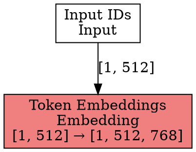
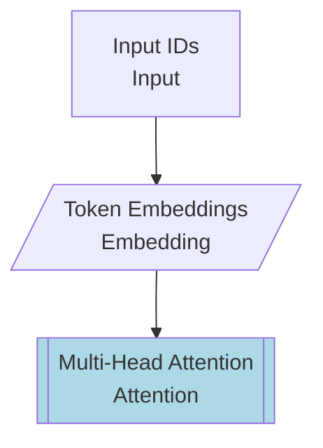

# Model Architecture Visualization Guide

This guide explains how to use TrustformeRS's model architecture visualization tools to create, analyze, and export model graphs.

## Overview

The visualization module provides tools to:
- Create model architecture graphs manually or automatically
- Export graphs in multiple formats (DOT, Mermaid, JSON, PlantUML, SVG)
- Analyze models for optimization opportunities
- Generate interactive visualizations

## Quick Start

```rust
use trustformers_core::visualization::{ModelVisualizer, GraphFormat};

// Create a visualizer
let visualizer = ModelVisualizer::new()
    .with_params(true)    // Include parameter counts
    .with_shapes(true);   // Include tensor shapes

// Visualize a transformer model
let graph = visualizer.visualize_transformer(
    "BERT-Base",
    12,     // num_layers
    768,    // hidden_size
    12,     // num_heads
    30522,  // vocab_size
)?;

// Export to different formats
graph.export(GraphFormat::Dot, Path::new("model.dot"))?;
graph.export(GraphFormat::Mermaid, Path::new("model.mmd"))?;
graph.export(GraphFormat::Svg, Path::new("model.svg"))?;
```

## Graph Components

### Nodes

Each node in the graph represents a layer or operation:

```rust
use trustformers_core::visualization::GraphNode;

let node = GraphNode {
    id: "attention_0".to_string(),
    label: "Multi-Head Attention\n12 heads".to_string(),
    node_type: "Attention".to_string(),
    properties: HashMap::from([
        ("num_heads".to_string(), "12".to_string()),
        ("hidden_size".to_string(), "768".to_string()),
    ]),
    input_shape: Some(vec![1, 512, 768]),
    output_shape: Some(vec![1, 512, 768]),
};
```

### Edges

Edges represent tensor flow between layers:

```rust
use trustformers_core::visualization::GraphEdge;

let edge = GraphEdge {
    from: "layer_0".to_string(),
    to: "layer_1".to_string(),
    label: Some("residual".to_string()),
    tensor_shape: Some(vec![1, 512, 768]),
};
```

## Automatic Visualization

### Visualizing Standard Architectures

The `AutoVisualizer` can automatically create graphs for common architectures:

```rust
use trustformers_core::visualization::AutoVisualizer;

let mut visualizer = AutoVisualizer::new();

// Visualize BERT
let bert_graph = visualizer.visualize_bert_model(12)?;

// Visualize GPT
let gpt_graph = visualizer.visualize_gpt_model(12)?;
```

### Custom Model Visualization

For custom models, you can build graphs programmatically:

```rust
let mut graph = ModelGraph::new("MyCustomModel");

// Add input
graph.add_node(GraphNode {
    id: "input".to_string(),
    label: "Input Embeddings".to_string(),
    node_type: "Embedding".to_string(),
    properties: HashMap::new(),
    input_shape: Some(vec![1, 128]),
    output_shape: Some(vec![1, 128, 512]),
});

// Add custom layers
for i in 0..6 {
    let layer_id = format!("layer_{}", i);
    graph.add_node(GraphNode {
        id: layer_id.clone(),
        label: format!("Custom Layer {}", i),
        node_type: "CustomLayer".to_string(),
        properties: HashMap::new(),
        input_shape: Some(vec![1, 128, 512]),
        output_shape: Some(vec![1, 128, 512]),
    });
    
    // Connect layers
    let prev_id = if i == 0 { "input" } else { &format!("layer_{}", i-1) };
    graph.add_edge(GraphEdge {
        from: prev_id.to_string(),
        to: layer_id,
        label: None,
        tensor_shape: Some(vec![1, 128, 512]),
    });
}
```

## Export Formats

### Graphviz DOT

The DOT format is ideal for generating high-quality visualizations:

```rust
let dot_content = graph.to_dot()?;
// Or export directly
graph.export(GraphFormat::Dot, Path::new("model.dot"))?;
```

Example DOT output:


### Mermaid Diagrams

Mermaid is great for documentation and GitHub rendering:

```rust
let mermaid = graph.to_mermaid()?;
```

Example Mermaid output:


### JSON Export

JSON format is useful for programmatic processing:

```rust
let json = graph.to_json()?;
```

Example JSON structure:
```json
{
  "name": "BERT Model",
  "nodes": [
    {
      "id": "input",
      "label": "Input IDs",
      "node_type": "Input",
      "input_shape": [1, 512],
      "output_shape": [1, 512]
    }
  ],
  "edges": [
    {
      "from": "input",
      "to": "embedding",
      "tensor_shape": [1, 512]
    }
  ],
  "metadata": {
    "num_layers": "12",
    "total_params": "110M"
  }
}
```

### SVG Export

SVG export requires Graphviz to be installed:

```rust
// Requires 'dot' command to be available
graph.export(GraphFormat::Svg, Path::new("model.svg"))?;
```

## Model Analysis

### Analyzing Model Graphs

The `GraphAnalyzer` provides insights about your model:

```rust
use trustformers_core::visualization::GraphAnalyzer;

let report = GraphAnalyzer::analyze(&graph);

println!("Total Parameters: {:.1}M", report.total_parameters as f32 / 1e6);
println!("Layer Distribution: {:?}", report.layer_distribution);
println!("Bottlenecks: {:?}", report.bottlenecks);
println!("Suggestions: {:?}", report.optimization_suggestions);
```

### Analysis Report

The analyzer detects:
- **Parameter Distribution**: Where parameters are concentrated
- **Bottlenecks**: Shape mismatches, excessive parameters
- **Optimization Opportunities**: Weight sharing, sparse patterns, vocabulary size

Example output:
```
Total Parameters: 110.5M
Layer Distribution:
  Attention: 12
  FeedForward: 12
  LayerNorm: 25
  Embedding: 2
  Linear: 1

Bottlenecks:
  - Token Embeddings has 23.4M parameters (consider factorization)

Suggestions:
  - Consider using sparse attention patterns for long sequences
  - Large vocabulary (30522 tokens) - consider vocabulary pruning
```

## Interactive Visualization

### ASCII Art Display

For terminal output:

```rust
use trustformers_core::visualization::GraphExplorer;

let explorer = GraphExplorer::new(graph);
explorer.print_ascii()?;
```

Output:
```
Model: BERT-Base
==================================================

┌─ Input IDs ─┐
│ Input IDs   │
└─ Input IDs ─┘
  Shape: [1, 512] → [1, 512]
    ↓

┌─ Token Embeddings ─┐
│ Token Embeddings   │
└─ Token Embeddings ─┘
  Shape: [1, 512] → [1, 512, 768]
    ↓
```

## Best Practices

### 1. Node Naming

Use descriptive and consistent node IDs:
```rust
// Good
"layer_0_attention"
"layer_0_ffn"
"embedding_tokens"

// Avoid
"node1"
"attn"
"l0"
```

### 2. Shape Information

Always include shape information when known:
```rust
node.input_shape = Some(vec![batch_size, seq_len, hidden_dim]);
node.output_shape = Some(vec![batch_size, seq_len, hidden_dim]);
```

### 3. Metadata

Add relevant metadata for documentation:
```rust
graph.add_metadata("framework_version", env!("CARGO_PKG_VERSION"));
graph.add_metadata("created_date", chrono::Utc::now().to_string());
graph.add_metadata("purpose", "inference");
```

### 4. Color Coding

The visualizer automatically color-codes different layer types:
- **Blue**: Attention layers
- **Green**: Linear/Dense layers
- **Yellow**: Normalization layers
- **Coral**: Embedding layers
- **Gray**: Activation functions

## Advanced Usage

### Custom Node Types

Define custom node types for specialized layers:

```rust
let custom_node = GraphNode {
    id: "mixture_of_experts".to_string(),
    label: "MoE Layer\n8 experts".to_string(),
    node_type: "MixtureOfExperts".to_string(),
    properties: HashMap::from([
        ("num_experts".to_string(), "8".to_string()),
        ("top_k".to_string(), "2".to_string()),
    ]),
    input_shape: Some(vec![1, 512, 768]),
    output_shape: Some(vec![1, 512, 768]),
};
```

### Hierarchical Graphs

Create sub-graphs for complex models:

```rust
// Main graph
let mut main_graph = ModelGraph::new("Full Model");

// Create encoder sub-graph
let encoder_graph = create_encoder_graph()?;
let decoder_graph = create_decoder_graph()?;

// Add as composite nodes
main_graph.add_node(GraphNode {
    id: "encoder".to_string(),
    label: format!("Encoder\n{} layers", 6),
    node_type: "Subgraph".to_string(),
    properties: HashMap::from([
        ("subgraph".to_string(), serde_json::to_string(&encoder_graph)?),
    ]),
    input_shape: Some(vec![1, 512, 768]),
    output_shape: Some(vec![1, 512, 768]),
});
```

### Dynamic Visualization

Update graphs during training:

```rust
pub struct TrainingVisualizer {
    graph: ModelGraph,
    iteration: usize,
}

impl TrainingVisualizer {
    pub fn update_metrics(&mut self, layer_id: &str, metrics: &LayerMetrics) {
        if let Some(node) = self.graph.nodes.iter_mut().find(|n| n.id == layer_id) {
            node.properties.insert(
                "gradient_norm".to_string(),
                format!("{:.4}", metrics.gradient_norm),
            );
            node.properties.insert(
                "activation_mean".to_string(),
                format!("{:.4}", metrics.activation_mean),
            );
        }
    }
    
    pub fn export_snapshot(&self, output_dir: &Path) -> Result<()> {
        let filename = format!("model_iter_{}.svg", self.iteration);
        let path = output_dir.join(filename);
        self.graph.export(GraphFormat::Svg, &path)?;
        self.iteration += 1;
        Ok(())
    }
}
```

## Integration with Other Tools

### Tensorboard Integration

Export to Tensorboard-compatible format:

```rust
pub fn export_to_tensorboard(graph: &ModelGraph) -> Result<()> {
    // Convert to ONNX-like representation
    let onnx_graph = convert_to_onnx_format(graph)?;
    
    // Write to event file
    let writer = SummaryWriter::new("./logs")?;
    writer.add_graph("model", &onnx_graph)?;
    
    Ok(())
}
```

### Jupyter Notebook Display

Generate HTML for notebook display:

```rust
pub fn to_html(graph: &ModelGraph) -> Result<String> {
    let svg = graph.to_svg_string()?;
    
    Ok(format!(r#"
        <div style="text-align: center;">
            <h3>{}</h3>
            {}
            <p>Total Parameters: {:.1}M</p>
        </div>
    "#, graph.name, svg, calculate_params(graph) as f32 / 1e6))
}
```

## Troubleshooting

### Common Issues

1. **Graphviz not found**
   ```bash
   # Install Graphviz
   # Ubuntu/Debian
   sudo apt-get install graphviz
   
   # macOS
   brew install graphviz
   
   # Windows
   choco install graphviz
   ```

2. **Large graphs are cluttered**
   - Use hierarchical layout
   - Group related nodes
   - Limit visualization depth
   - Export sections separately

3. **Shape mismatches not detected**
   - Ensure all nodes have shape information
   - Use the analyzer to find issues
   - Enable strict mode in visualizer

## Examples Gallery

### Transformer Block
```rust
visualizer.visualize_transformer("transformer", 1, 512, 8, 10000)
```

### CNN Architecture
```rust
let mut graph = ModelGraph::new("CNN");
// Add conv layers with decreasing spatial dims
for i in 0..5 {
    let size = 224 >> i;
    let channels = 64 << i;
    graph.add_node(GraphNode {
        id: format!("conv_{}", i),
        label: format!("Conv2D {}x{}", 3, 3),
        node_type: "Conv2D".to_string(),
        properties: HashMap::new(),
        input_shape: Some(vec![1, channels/2, size*2, size*2]),
        output_shape: Some(vec![1, channels, size, size]),
    });
}
```

### RNN/LSTM
```rust
graph.add_node(GraphNode {
    id: "lstm".to_string(),
    label: "LSTM\n256 hidden units".to_string(),
    node_type: "LSTM".to_string(),
    properties: HashMap::from([
        ("hidden_size".to_string(), "256".to_string()),
        ("num_layers".to_string(), "2".to_string()),
        ("bidirectional".to_string(), "true".to_string()),
    ]),
    input_shape: Some(vec![1, 100, 128]),
    output_shape: Some(vec![1, 100, 512]),
});
```