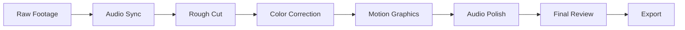

# TrustformeRS Mobile Video Tutorial Production Guide

## Overview

This comprehensive guide outlines the complete production process for creating professional video tutorials for TrustformeRS Mobile. It covers pre-production planning, recording techniques, post-production workflows, and distribution strategies.

## Pre-Production Phase

### 1. Content Planning and Scripting

#### Script Development Process
1. **Research and Outline**
   - Review latest TrustformeRS documentation
   - Identify key learning objectives
   - Create detailed content outline
   - Plan code examples and demonstrations

2. **Script Writing**
   - Write conversational, engaging narration
   - Include timing marks for visual elements
   - Plan interaction points and pauses
   - Review for technical accuracy

3. **Technical Review**
   - Code review by TrustformeRS core team
   - Accuracy verification by subject matter experts
   - Accessibility considerations review
   - Cross-platform compatibility check

#### Script Template Structure
```markdown
## Video Title
- Duration: X-Y minutes
- Prerequisites: List requirements
- Learning Objectives: Clear goals

### Segment 1 (00:00 - 01:30)
**[Visual: Description of what's on screen]**
**Narrator**: "Script content with timing cues..."
**[Action: Specific actions to perform]**

### Code Examples
```language
// Well-commented code with explanations
```

### Visual Assets Needed
- List of screenshots, diagrams, animations required
```

### 2. Technical Setup and Environment Preparation

#### Development Environment Setup
- **macOS for iOS Development**
  - Latest Xcode with iOS SDK
  - Multiple iOS Simulators (iPhone, iPad)
  - Physical test devices (iPhone 13+, iPad Pro)
  - Performance monitoring tools (Instruments)

- **Windows/macOS for Android Development**
  - Android Studio with latest SDK
  - Multiple Android emulators (various API levels)
  - Physical test devices (Pixel, Samsung, OnePlus)
  - Android Studio Profiler

- **Cross-Platform Tools**
  - React Native CLI and dependencies
  - Flutter SDK and development tools
  - Unity Hub with mobile build modules
  - VSCode with relevant extensions

#### Recording Equipment Setup
```yaml
Hardware Requirements:
  Primary Computer:
    - MacBook Pro M2 Max (32GB RAM minimum)
    - External 4K monitor for expanded workspace
    - High-speed storage (2TB+ SSD)
  
  Audio Equipment:
    - Professional USB microphone (Blue Yeti Pro or Rode PodMic)
    - Audio interface (Focusrite Scarlett Solo)
    - Closed-back headphones (Sony MDR-7506)
    - Acoustic treatment for recording space
  
  Video Equipment:
    - Secondary camera for presenter shots (optional)
    - Professional lighting kit
    - Green screen setup (for complex compositions)

Software Requirements:
  Screen Recording:
    - Primary: ScreenFlow (macOS) or Camtasia (Windows)
    - Backup: OBS Studio (free, cross-platform)
    - Mobile: QuickTime Player for iOS device recording
  
  Audio Recording:
    - Audacity (free) or Adobe Audition
    - Audio noise reduction plugins
  
  Post-Production:
    - Video Editing: Final Cut Pro X or Adobe Premiere Pro
    - Motion Graphics: After Effects or Motion
    - Color Correction: DaVinci Resolve
```

### 3. Asset Creation and Preparation

#### Visual Assets Development
1. **Diagrams and Illustrations**
   - Architecture diagrams using Sketch or Figma
   - Flow charts for development processes
   - Performance comparison charts
   - Platform compatibility matrices

2. **UI Mockups and Prototypes**
   - High-fidelity app mockups
   - Interactive prototypes for demonstration
   - Before/after comparison screens

3. **Code Syntax Highlighting**
   - Consistent color schemes across platforms
   - High contrast for accessibility
   - Appropriate font sizes for video viewing
   - Syntax highlighting templates

#### Sample Code Preparation
```swift
// iOS Example - Prepared with clear comments
import TrustformersKit

class SentimentAnalyzer: ObservableObject {
    // Properties clearly defined for tutorial
    @Published var isLoading = false
    @Published var result: String = ""
    
    private let engine: TFKInferenceEngine
    
    init() {
        // Configuration explained step-by-step
        let config = TFKModelConfig(
            modelName: "distilbert-base-uncased",
            quantization: .fp16,
            backend: .hybrid
        )
        
        self.engine = TFKInferenceEngine(config: config)
    }
    
    // Method designed for clear demonstration
    func analyzeSentiment(_ text: String) async {
        // Implementation with clear explanations
    }
}
```

## Production Phase

### 1. Recording Best Practices

#### Screen Recording Techniques
- **Resolution**: 1920x1080 minimum, 3840x2160 preferred for crisp display
- **Frame Rate**: 60fps for smooth scrolling and animations
- **Bitrate**: High quality settings to prevent compression artifacts
- **Mouse Cursor**: Enlarge cursor for better visibility
- **Zoom and Pan**: Smooth camera movements, avoid jarring transitions

#### Audio Recording Standards
```yaml
Audio Specifications:
  Format: WAV 48kHz/24-bit (lossless)
  Environment: Quiet room with minimal echo
  Microphone Distance: 6-8 inches from mouth
  Gain Levels: Peak at -12dB, average -18dB
  Noise Floor: Below -60dB
  
Recording Techniques:
  - Record room tone for noise reduction
  - Use pop filter to reduce plosives
  - Maintain consistent distance from microphone
  - Record in segments for easier editing
  - Always record a backup audio track
```

#### Live Coding Demonstration
- **Typing Speed**: Moderate pace allowing viewers to follow
- **Code Completion**: Use IDE features naturally but explain them
- **Error Handling**: Show and fix common mistakes deliberately
- **Debugging**: Demonstrate problem-solving process
- **Testing**: Always show the final result working

### 2. Multi-Platform Recording Workflows

#### iOS Development Recording
1. **Xcode Screen Recording**
   - Use presentation mode for larger UI elements
   - Show console output when relevant
   - Demonstrate Simulator and physical device testing
   - Record Instruments performance profiling

2. **Device Recording**
   - Use QuickTime Player for iOS device recording
   - Ensure stable connection and good lighting
   - Show touch interactions clearly
   - Capture performance metrics on device

#### Android Development Recording
1. **Android Studio Recording**
   - Enable presentation mode
   - Show Gradle sync and build processes
   - Demonstrate emulator and physical device testing
   - Include Android Studio Profiler output

2. **Device Recording**
   - Use Android Studio's screen recording
   - Enable developer options touches
   - Show GPU profiling and performance overlays
   - Capture various device form factors

### 3. Quality Control During Recording

#### Real-Time Monitoring
- **Audio Levels**: Continuous monitoring with visual meters
- **Video Quality**: Regular checking for compression artifacts
- **Code Accuracy**: Testing all code segments as recorded
- **Timing**: Staying within planned segment durations

#### Checkpoint Reviews
- Review each segment immediately after recording
- Verify all code examples compile and run
- Check audio quality and clarity
- Ensure visual elements are clearly visible

## Post-Production Phase

### 1. Video Editing Workflow

#### Editing Pipeline


#### Detailed Editing Steps
1. **Assembly Edit**
   - Sync all audio and video tracks
   - Create rough timeline with major segments
   - Remove obvious errors and long pauses
   - Add basic transitions

2. **Fine Cut Editing**
   - Adjust timing for optimal pacing
   - Add callouts and annotations
   - Insert motion graphics and animations
   - Synchronize with script timing marks

3. **Audio Post-Production**
   - Noise reduction and audio cleaning
   - Level normalization and EQ
   - Background music addition (subtle, non-intrusive)
   - Audio ducking for emphasis

4. **Visual Enhancement**
   - Color correction for consistency
   - Screen recording enhancement
   - Add zoom and pan effects for emphasis
   - Insert diagrams and supplementary visuals

### 2. Motion Graphics and Animations

#### Standard Graphics Package
- **Lower Thirds**: Presenter identification and credentials
- **Code Callouts**: Highlighting specific code lines
- **Transitions**: Smooth section transitions
- **Progress Indicators**: Tutorial progress visualization
- **Interactive Elements**: Buttons, links, and navigation

#### Animation Principles
- **Smooth Easing**: Natural motion curves for all animations
- **Consistent Timing**: Standard duration for similar animations
- **Clear Purpose**: Every animation should aid understanding
- **Accessibility**: High contrast and readable text

### 3. Audio Post-Production

#### Audio Enhancement Pipeline
1. **Noise Reduction**
   - Remove background noise using spectral analysis
   - Reduce room tone and electrical interference
   - Preserve natural voice characteristics

2. **Dynamic Processing**
   - Gentle compression for even levels
   - De-essing to reduce sibilance
   - Limiting to prevent peaks

3. **EQ and Enhancement**
   - High-pass filter to remove low-frequency rumble
   - Gentle midrange enhancement for clarity
   - Subtle high-frequency boost for presence

4. **Final Processing**
   - Loudness normalization to broadcast standards
   - Export in multiple formats for different platforms

### 4. Accessibility Implementation

#### Closed Captions
- **Accuracy**: 99%+ accuracy for technical terms
- **Timing**: Precise synchronization with audio
- **Formatting**: Proper capitalization and punctuation
- **Technical Terms**: Spelled out completely
- **Code Reading**: Character-by-character for important code

#### Audio Descriptions
- Describe visual elements not covered in narration
- Explain on-screen actions and interface interactions
- Provide context for visual demonstrations
- Maintain natural flow and timing

#### Visual Accessibility
- **High Contrast**: Ensure sufficient contrast ratios
- **Font Sizes**: Large enough for mobile viewing
- **Color Independence**: Don't rely solely on color for information
- **Clear Layouts**: Uncluttered, easy to follow visual design

## Quality Assurance and Review

### 1. Technical Review Process

#### Code Accuracy Verification
- **Compilation Testing**: All code must compile without errors
- **Functionality Testing**: Verify all demonstrated features work
- **Version Compatibility**: Test with current TrustformeRS versions
- **Cross-Platform Testing**: Verify examples work on target platforms

#### Content Review Checklist
```yaml
Technical Accuracy:
  - [ ] All APIs and methods are current
  - [ ] Code examples compile and run
  - [ ] Performance claims are verified
  - [ ] Platform-specific details are accurate

Educational Quality:
  - [ ] Learning objectives are met
  - [ ] Progression is logical and clear
  - [ ] Prerequisites are properly stated
  - [ ] Next steps are clearly defined

Production Quality:
  - [ ] Audio is clear and professional
  - [ ] Video quality meets standards
  - [ ] Graphics enhance understanding
  - [ ] Pacing allows for comprehension

Accessibility:
  - [ ] Captions are accurate and synchronized
  - [ ] Visual elements are described
  - [ ] High contrast maintained throughout
  - [ ] All text is readable
```

### 2. Expert Review and Feedback

#### Review Panel Composition
- **Technical Experts**: TrustformeRS core developers
- **Educational Specialists**: Learning experience designers
- **Platform Experts**: iOS and Android specialists
- **Accessibility Experts**: Inclusive design reviewers
- **Community Representatives**: Developer community feedback

#### Feedback Integration Process
1. **Structured Review**: Use standardized review forms
2. **Prioritized Feedback**: Address critical issues first
3. **Iterative Improvement**: Multiple review cycles
4. **Final Sign-off**: Approval from all stakeholders

## Distribution and Publishing

### 1. Platform-Specific Optimization

#### YouTube Optimization
```yaml
Video Specifications:
  Resolution: 3840x2160 (4K) for future-proofing
  Frame Rate: 60fps for smooth playback
  Codec: H.264 with high bitrate
  Audio: AAC 192kbps stereo

Metadata Optimization:
  Title: Descriptive with relevant keywords
  Description: Detailed with timestamps and links
  Tags: Comprehensive technical keywords
  Thumbnail: Professional, descriptive image
  Cards: Strategic placement for engagement
  End Screen: Promote related content

Accessibility:
  Captions: Uploaded as SRT files
  Chapters: Detailed chapter markers
  Descriptions: Include transcript links
```

#### Website Integration
- **Embed Code**: Responsive video players
- **Download Options**: Offline viewing capabilities
- **Transcript Integration**: Searchable text content
- **Related Resources**: Links to documentation and code

### 2. SEO and Discoverability

#### Content Marketing Strategy
- **Blog Post Creation**: Accompanying written tutorials
- **Social Media Promotion**: Platform-specific content
- **Developer Community Engagement**: Share in relevant forums
- **Conference Presentations**: Use content for speaking engagements

#### Search Optimization
- **Keyword Research**: Target relevant developer search terms
- **Meta Descriptions**: Compelling, descriptive summaries
- **Schema Markup**: Structured data for better indexing
- **Cross-Linking**: Connect related tutorials and documentation

### 3. Analytics and Performance Tracking

#### Key Performance Indicators
```yaml
Engagement Metrics:
  - View Duration: Target 60%+ completion rate
  - Engagement Rate: Likes, comments, shares
  - Click-Through Rate: To related content
  - Subscriber Growth: New channel subscribers

Educational Impact:
  - GitHub Repository Activity: Stars, forks, issues
  - Documentation Views: Increased traffic
  - Community Questions: Related forum activity
  - Developer Adoption: New project integrations

Technical Metrics:
  - Video Quality: Playback error rates
  - Loading Performance: Buffer rates
  - Mobile Optimization: Mobile viewing stats
  - Accessibility Usage: Caption usage rates
```

#### Continuous Improvement Process
1. **Regular Analytics Review**: Monthly performance analysis
2. **Feedback Collection**: User surveys and comments
3. **Content Updates**: Keep tutorials current with new releases
4. **Format Optimization**: Adapt based on performance data

## Maintenance and Updates

### 1. Content Lifecycle Management

#### Regular Review Schedule
- **Monthly**: Check for broken links and outdated information
- **Quarterly**: Review performance metrics and user feedback
- **Semi-Annually**: Major content updates for new features
- **Annually**: Complete tutorial series review and refresh

#### Version Control for Tutorials
```yaml
Tutorial Versioning:
  Major Version: Complete re-recording for significant changes
  Minor Version: Audio corrections and minor visual updates
  Patch Version: Subtitle corrections and link updates

Change Management:
  - Track all modifications with detailed logs
  - Maintain backward compatibility when possible
  - Provide migration guides for breaking changes
  - Archive old versions for reference
```

### 2. Community Feedback Integration

#### Feedback Collection Mechanisms
- **Comment Analysis**: Regular review of user comments
- **Survey Campaigns**: Periodic user experience surveys
- **Discord Community**: Active monitoring of discussion channels
- **GitHub Issues**: Track tutorial-related problems and suggestions

#### Response and Integration Process
1. **Feedback Categorization**: Technical, educational, accessibility
2. **Priority Assessment**: Impact and effort analysis
3. **Implementation Planning**: Schedule updates and improvements
4. **Communication**: Keep community informed of changes

## Budget and Resource Planning

### 1. Cost Estimation

#### Production Costs
```yaml
Personnel:
  Technical Producer: $80-120/hour x 40 hours = $3,200-4,800
  Video Editor: $50-80/hour x 30 hours = $1,500-2,400
  Motion Graphics: $60-100/hour x 20 hours = $1,200-2,000
  Audio Engineer: $40-70/hour x 10 hours = $400-700

Equipment:
  Recording Setup: $2,000-5,000 (one-time)
  Software Licenses: $500-1,500/year
  Hardware Refresh: $1,000-2,000/year

Ongoing Costs:
  Hosting and Distribution: $100-500/month
  Music Licensing: $200-500/year
  Equipment Maintenance: $200-500/year
```

#### ROI Considerations
- **Developer Adoption**: Increased framework usage
- **Community Growth**: Expanded developer community
- **Support Reduction**: Fewer basic support questions
- **Business Development**: New partnership opportunities

### 2. Resource Allocation

#### Team Structure
- **Project Manager**: Overall coordination and scheduling
- **Technical Producer**: Content creation and accuracy
- **Video Production**: Recording and editing
- **Community Manager**: Distribution and engagement
- **Quality Assurance**: Review and testing

#### Timeline Planning
```yaml
Pre-Production: 3-4 weeks
  Week 1-2: Script development and review
  Week 3: Asset creation and preparation
  Week 4: Technical setup and testing

Production: 2-3 weeks
  Week 1: Recording all segments
  Week 2: Quality review and re-recording
  Week 3: Buffer for additional content

Post-Production: 3-4 weeks
  Week 1: Assembly edit and rough cut
  Week 2: Motion graphics and audio polish
  Week 3: Color correction and final edit
  Week 4: Review, approval, and export

Distribution: 1 week
  Week 1: Upload, optimization, and launch
```

## Success Metrics and KPIs

### 1. Quantitative Metrics

#### Viewership and Engagement
- **Total Views**: Target 50,000+ views per tutorial series
- **Average View Duration**: 60%+ completion rate
- **Engagement Rate**: 8%+ (likes, comments, shares)
- **Subscriber Growth**: 500+ new subscribers per series
- **Click-Through Rate**: 15%+ to related content

#### Educational Impact
- **GitHub Repository Activity**: 200%+ increase in stars/forks
- **Documentation Traffic**: 150%+ increase in relevant pages
- **Community Questions**: 50%+ reduction in basic questions
- **Project Implementations**: 100+ new projects using tutorials

### 2. Qualitative Metrics

#### User Satisfaction
- **Tutorial Rating**: 4.5+ stars average
- **Comment Sentiment**: 90%+ positive feedback
- **Community Testimonials**: Regular success stories
- **Expert Recognition**: Industry acknowledgment

#### Learning Effectiveness
- **Concept Comprehension**: Survey-based assessment
- **Skill Application**: Real-world implementation success
- **Knowledge Retention**: Follow-up assessment results
- **Problem-Solving Ability**: Community help forum activity

## Conclusion

This comprehensive production guide ensures the creation of high-quality, accessible, and effective video tutorials for TrustformeRS Mobile. By following these guidelines, we can create educational content that accelerates developer adoption, reduces support burden, and strengthens the TrustformeRS community.

The investment in professional tutorial production pays dividends through increased developer satisfaction, faster onboarding, and stronger community engagement. Regular review and updates ensure the content remains valuable and current with evolving technology and user needs.

---

**Next Steps**: Begin with pilot tutorial production using this guide, gather feedback, and refine the process based on initial results. This iterative approach ensures continuous improvement in both process and output quality.